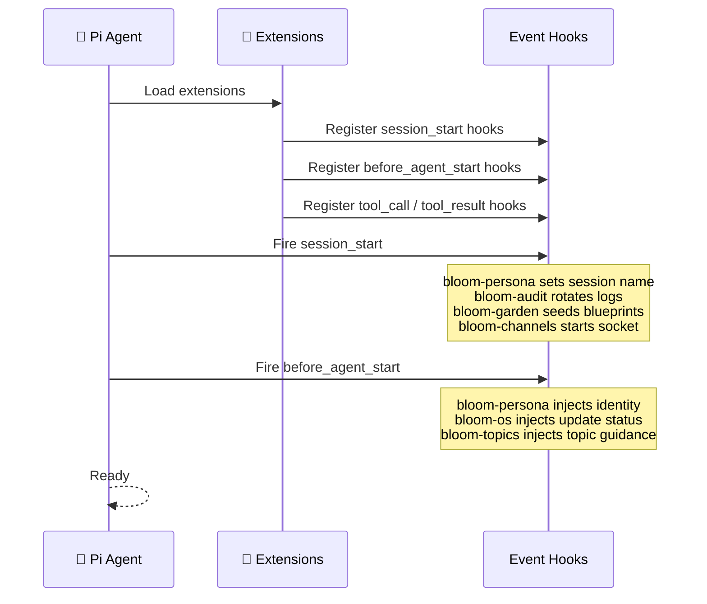
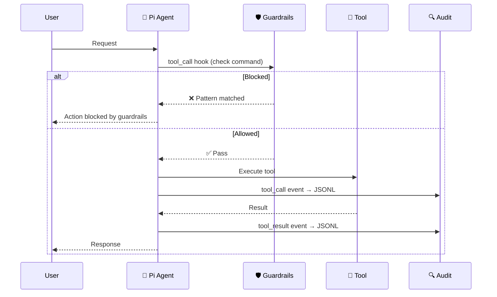
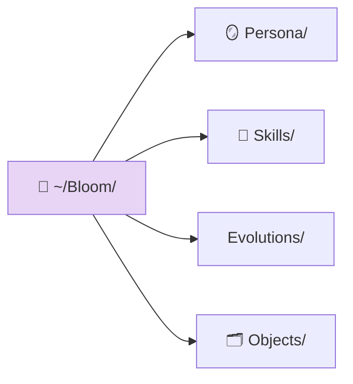

# AGENTS.md

> 📖 [Emoji Legend](docs/LEGEND.md)

## 🌱 Bloom — Pi-Native OS Platform

Bloom is a Pi package that turns a Fedora bootc machine into a personal AI companion host. Pi IS the product; Bloom teaches Pi about its OS.

## 🌱 Extensibility Hierarchy

Bloom extends Pi through three mechanisms, lightest first: **Skill → Extension → Service**.

| Layer | What | When | Created By |
|-------|------|------|------------|
| **Skill** | Markdown instructions (SKILL.md) | Pi needs knowledge or a procedure | Pi or developer |
| **Extension** | In-process TypeScript | Pi needs commands, tools, or event hooks | Developer (PR required) |
| **Service** | OCI container (Podman Quadlet) | Standalone workload needing isolation | Pi or developer |

Always prefer the lightest option. See `docs/service-architecture.md` for details.

For reproducible releases and artifact trust rules, see `docs/supply-chain.md`.
For multi-device code contribution and PR flow, see `docs/fleet-pr-workflow.md`, `docs/fleet-bootstrap-checklist.md`, and `docs/fleet-pr-workflow-plan.md`.

## 🧩 Extensions





### 🪞 bloom-persona (217 lines)

Identity injection, safety guardrails, and compaction context.

**Hooks:**
- `session_start` — Set session name to "Bloom"
- `before_agent_start` — Inject 4-layer persona (SOUL/BODY/FACULTY/SKILL) + restored compaction context into system prompt
- `tool_call` — Check bash commands against guardrails, block if pattern matches
- `session_before_compact` — Save context (active topic, pending channels, update status) to `~/.pi/bloom-context.json`

### 🔍 bloom-audit (183 lines)

Tool-call audit trail with 30-day retention.

**Tools:** `audit_review`
**Hooks:**
- `session_start` — Rotate audit logs, ensure audit directory
- `tool_call` — Append tool call event to daily JSONL
- `tool_result` — Append tool result event to daily JSONL

### 💻 bloom-os (402 lines)

OS management: bootc lifecycle, containers, systemd, health, updates.

**Tools:**
- Bootc: `bootc_status`, `bootc_update`, `bootc_rollback`
- Containers: `container_status`, `container_logs`, `container_deploy`
- System: `systemd_control`, `system_health`
- Updates: `update_status`, `schedule_reboot`

**Hooks:**
- `before_agent_start` — Inject OS update availability into system prompt

### 🔀 bloom-repo (371 lines)

Repository management: configure, sync, submit PRs, check status.

**Tools:** `bloom_repo_configure`, `bloom_repo_sync`, `bloom_repo_submit_pr`, `bloom_repo_status`

### 📋 bloom-manifest (419 lines)

Declarative service manifest: show, sync, set, apply.

**Tools:** `manifest_show`, `manifest_sync`, `manifest_set_service`, `manifest_apply`
**Hooks:**
- `session_start` — Check manifest drift, display status widget

### 📦 bloom-services (570 lines)

Service lifecycle: scaffold, publish, install, and test OCI service packages.

**Tools:** `service_scaffold`, `service_publish`, `service_install`, `service_test`
**Hooks:**
- `session_start` — Set UI status

### 🗂️ bloom-objects

Flat-file object store with YAML frontmatter + Markdown in `~/Bloom/Objects/`.

**Tools:** `memory_create`, `memory_read`, `memory_search`, `memory_link`, `memory_list`

### 🌿 bloom-garden

Bloom directory management, blueprint seeding, skill creation, persona evolution.

**Tools:** `garden_status`, `skill_create`, `skill_list`, `persona_evolve`
**Commands:** `/bloom` (init | status | update-blueprints)
**Hooks:**
- `session_start` — Ensure Bloom directory structure, seed blueprints (hash-based change detection)
- `resources_discover` — Return skill paths from `~/Bloom/Skills/`

### 📡 bloom-channels (410 lines)

Channel bridge Unix socket server at `/run/bloom/channels.sock`. JSON-newline protocol with rate limiting and heartbeat.

**Commands:** `/wa` (send message to WhatsApp channel)
**Hooks:**
- `session_start` — Create Unix socket server, load channel tokens
- `agent_end` — Extract response, send back to channel socket by message ID
- `session_shutdown` — Close socket server, cleanup

### 🗂️ bloom-topics (162 lines)

Conversation topic management and session organization.

**Commands:** `/topic` (new | close | list | switch)
**Hooks:**
- `session_start` — Store last context
- `before_agent_start` — Inject topic guidance into system prompt
- `session_start` — Initialize topic state

## 🧩 All Registered Tools (30)

Quick reference of every tool name available to Pi:

| Tool | Extension | Purpose |
|------|-----------|---------|
| `audit_review` | bloom-audit | Inspect recent audited tool activity |
| `bootc_status` | bloom-os | Show OS image version, staged updates |
| `bootc_update` | bloom-os | Check/download/apply OS updates |
| `bootc_rollback` | bloom-os | Rollback to previous OS image |
| `container_status` | bloom-os | List running bloom-* containers |
| `container_logs` | bloom-os | Tail logs for a service |
| `container_deploy` | bloom-os | Daemon-reload + start a Quadlet unit |
| `systemd_control` | bloom-os | Start/stop/restart/status a service |
| `system_health` | bloom-os | Comprehensive health overview |
| `update_status` | bloom-os | Check if OS update is available |
| `schedule_reboot` | bloom-os | Schedule a delayed reboot |
| `bloom_repo_configure` | bloom-repo | Bootstrap repo, set remotes, git identity |
| `bloom_repo_sync` | bloom-repo | Sync from upstream branch |
| `bloom_repo_submit_pr` | bloom-repo | Create PR from local changes |
| `bloom_repo_status` | bloom-repo | Check repo health, remotes, GitHub auth |
| `manifest_show` | bloom-manifest | Display service manifest |
| `manifest_sync` | bloom-manifest | Reconcile manifest with running state |
| `manifest_set_service` | bloom-manifest | Declare service in manifest |
| `manifest_apply` | bloom-manifest | Apply desired state |
| `service_scaffold` | bloom-services | Generate service package skeleton |
| `service_publish` | bloom-services | Publish package to OCI registry (oras) |
| `service_install` | bloom-services | Pull and install package from registry |
| `service_test` | bloom-services | Smoke-test installed service units |
| `memory_create` | bloom-objects | Create new object in ~/Bloom/Objects/ |
| `memory_read` | bloom-objects | Read object by type/slug |
| `memory_search` | bloom-objects | Search objects by pattern |
| `memory_link` | bloom-objects | Add bidirectional links between objects |
| `memory_list` | bloom-objects | List objects (filter by type, frontmatter) |
| `garden_status` | bloom-garden | Show Bloom directory, file counts, blueprint state |
| `skill_create` | bloom-garden | Create new SKILL.md in ~/Bloom/Skills/ |
| `skill_list` | bloom-garden | List all skills in ~/Bloom/Skills/ |
| `persona_evolve` | bloom-garden | Propose persona layer change |

## 📜 Skills

| Skill | Purpose |
|-------|---------|
| `first-boot` | One-time system setup (LLM provider, GitHub auth, repo, services, sync) |
| `os-operations` | System health inspection and remediation (bootc, containers, systemd) |
| `object-store` | CRUD operations for the memory store |
| `service-management` | Install, manage, and discover OCI service packages |
| `self-evolution` | Structured system change workflow |
| `recovery` | Troubleshooting playbooks (WhatsApp, OS updates, Syncthing, disk, containers) |

## 📦 Services (OCI Packages)

Modular capabilities packaged as OCI artifacts, installed via `oras` from GHCR.
Canonical metadata for automation lives in `services/catalog.yaml`.

| Service | Category | Port |
|---------|----------|------|
| `bloom-svc-whisper` | media | 9000 |
| `bloom-svc-whatsapp` | communication | — |
| `bloom-svc-netbird` | networking | — |
| `bloom-svc-syncthing` | sync | 8384 |

## 🪞 Persona

OpenPersona 4-layer identity in `persona/`, seeded to `~/Bloom/Persona/` on first boot:
- `SOUL.md` — Identity, values, voice, boundaries
- `BODY.md` — Channel adaptation, presence behavior
- `FACULTY.md` — Reasoning patterns, decision frameworks
- `SKILL.md` — Current capabilities, tool preferences

### 🌿 Bloom Directory Structure



## 📖 Shared Library

`lib/shared.ts` — utilities re-exported via `extensions/shared.ts`:

| Export | Purpose |
|--------|---------|
| `getBloomDir()` | Resolve Bloom directory path (`$BLOOM_DIR` or `~/Bloom`) |
| `safePath(root, ...segments)` | Resolve path under root, blocking traversal |
| `parseFrontmatter<T>(str)` | Parse YAML frontmatter from markdown |
| `stringifyFrontmatter(data, content)` | Build markdown with YAML frontmatter |
| `createLogger(component)` | JSON-structured logging (debug/info/warn/error) |
| `truncate(text)` | Truncate to 2000 lines / 50KB |
| `errorResult(message)` | Standardized error response |
| `requireConfirmation(ctx, action)` | Prompt for UI confirmation, returns null or error string |
| `getServiceRegistry()` | Resolve OCI service registry from env |
| `nowIso()` | ISO timestamp without milliseconds |

## 🚀 Install

```bash
pi install /path/to/bloom
```

Or for development:
```bash
pi -e ./extensions/bloom-persona.ts -e ./extensions/bloom-audit.ts -e ./extensions/bloom-os.ts -e ./extensions/bloom-repo.ts -e ./extensions/bloom-manifest.ts -e ./extensions/bloom-services.ts -e ./extensions/bloom-objects.ts -e ./extensions/bloom-garden.ts -e ./extensions/bloom-channels.ts -e ./extensions/bloom-topics.ts
```

## 📖 Setup & Deployment Docs

- OS build/deploy/install: `docs/quick_deploy.md`
- First-boot setup flow: `docs/pibloom-setup.md`
- Fleet PR bootstrap: `docs/fleet-bootstrap-checklist.md`
- Channel protocol: `docs/channel-protocol.md`
- Service architecture: `docs/service-architecture.md`
- Supply chain trust: `docs/supply-chain.md`

## 🔗 Related

- [Emoji Legend](docs/LEGEND.md) — Notation reference
- [Service Architecture](docs/service-architecture.md) — Extensibility hierarchy details
