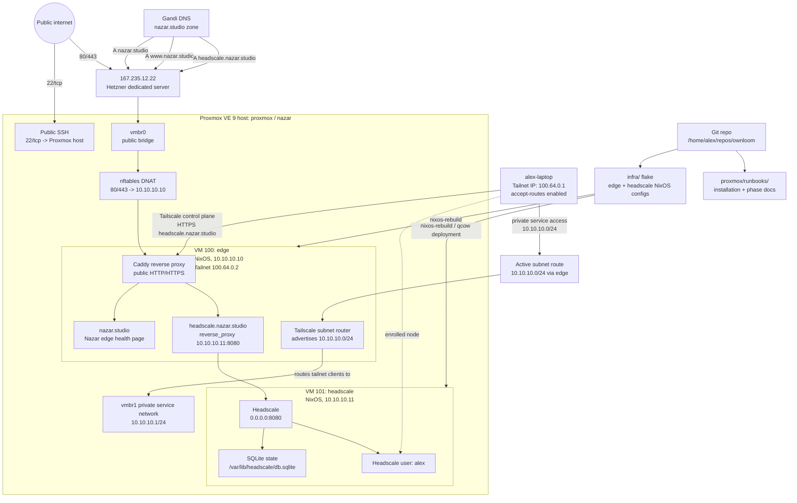
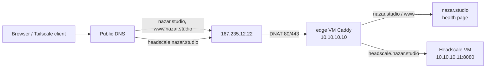
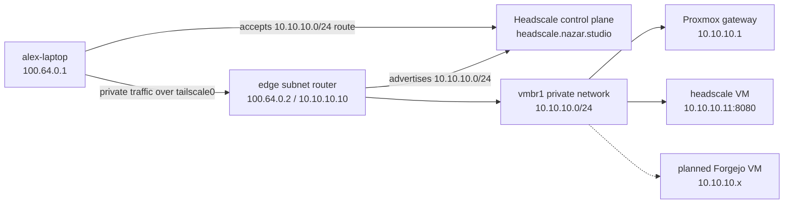
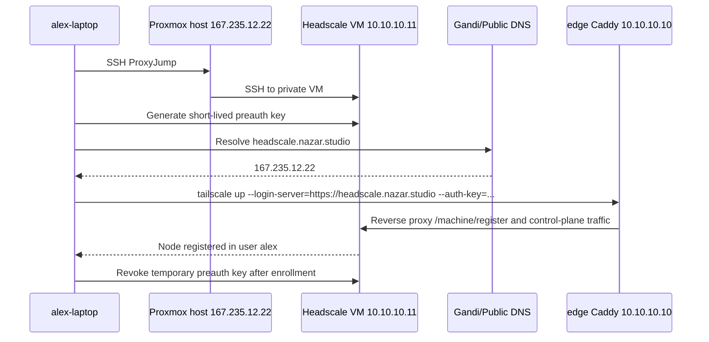

# Nazar infrastructure architecture

Date: 2026-05-19

This file is the always-current reference diagram for the active Nazar/Ownloom infrastructure. Update it in the same commit as any infrastructure change that adds, removes, renames, or re-routes hosts, services, DNS names, public ports, private networks, tailnet nodes, or deployment flows.

## Current topology

## Active public endpoints

## Active private subnet flow

## Headscale enrollment flow

## Current inventory

| Component | Current state |
| --- | --- |
| Public server | Hetzner dedicated server `167.235.12.22` |
| Host OS | Proxmox VE 9 on Debian 13/Trixie |
| Hostname | `proxmox`; operationally referred to as `nazar` |
| Public DNS | `nazar.studio`, `www.nazar.studio`, `headscale.nazar.studio` all point to `167.235.12.22` |
| Public ingress | Proxmox nftables forwards `80/tcp` and `443/tcp` to edge VM `10.10.10.10` |
| SSH ingress | `22/tcp` to Proxmox host |
| Private bridge | `vmbr1`, host gateway `10.10.10.1/24` |
| Edge VM | VM 100 `edge`, NixOS, `10.10.10.10`, Caddy, Tailscale subnet router, tailnet IP `100.64.0.2` |
| Headscale VM | VM 101 `headscale`, NixOS, `10.10.10.11`, Headscale on `8080` |
| Headscale state | `/var/lib/headscale`, SQLite database |
| Enrolled tailnet nodes | `alex-laptop` user device `100.64.0.1`; `edge` subnet router `100.64.0.2` |
| Private subnet route | `10.10.10.0/24` is advertised by `edge`, approved in Headscale, and accepted by `alex-laptop` |
| Next planned service | Forgejo on the private service network |

## Maintenance rule

When changing infrastructure, update this diagram and inventory alongside the implementation/runbook changes. In particular, update this file whenever any of the following change:

- DNS names or public endpoints.
- Public port exposure or DNAT/firewall rules.
- Proxmox bridges, VM IDs, private IPs, or guest roles.
- Caddy reverse proxy routes.
- Tailnet enrollment, subnet-router, or private-access flows.
- Repository layout or deployment source of truth.
