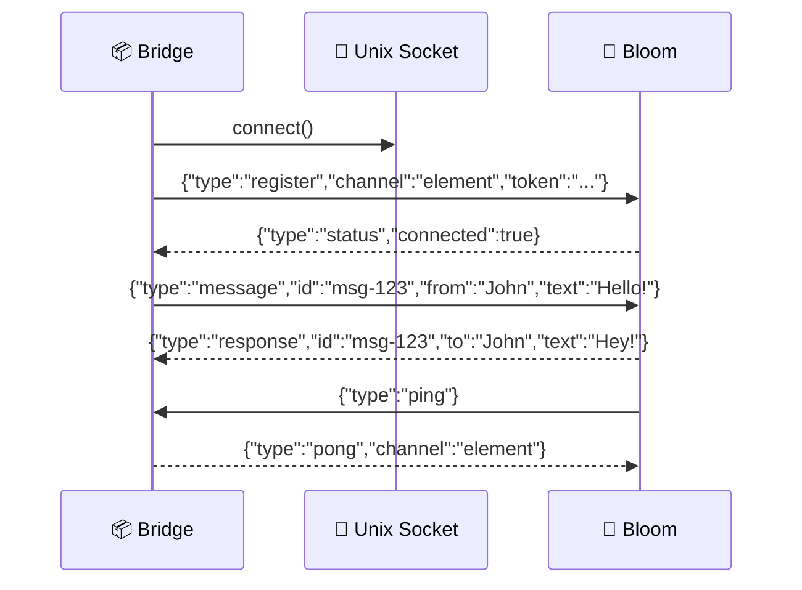
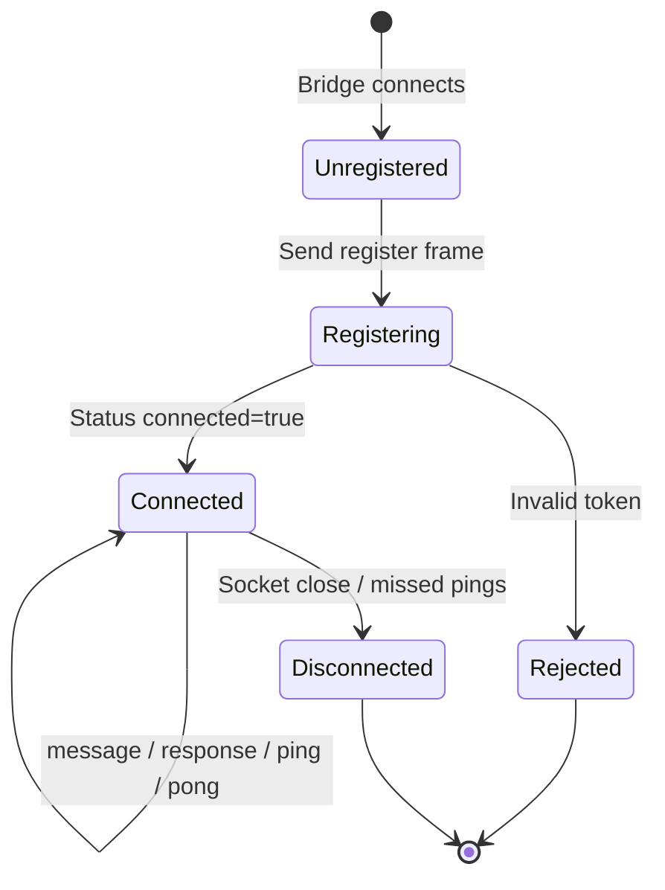

# Channel Protocol

> 📖 [Emoji Legend](LEGEND.md)

Bloom uses a JSON-over-Unix-socket bridge protocol for external messaging platforms.

## 📡 Connection

Bridges connect to the Unix socket:

- Default: `$XDG_RUNTIME_DIR/bloom/channels.sock`
- Override: `BLOOM_CHANNELS_SOCKET`

All frames are newline-delimited JSON (`\n`-terminated).

## 🛡️ Authentication

Each channel must register with a token from:

- `~/.config/bloom/channel-tokens/{channel}`

If token is missing or invalid, registration is rejected.

## 📡 Message Format

### 📡 Bridge → Bloom

**Register**

```json
{"type":"register","channel":"element","token":"<hex-token>"}
```

**Incoming message**

```json
{"type":"message","id":"msg-123","channel":"element","from":"John","text":"Hello!","timestamp":1709568000}
```

**Incoming message with media**

```json
{
  "type": "message",
  "id": "msg-124",
  "channel": "element",
  "from": "John",
  "timestamp": 1709568000,
  "media": {
    "kind": "audio",
    "mimetype": "audio/ogg",
    "filepath": "/var/lib/bloom/media/1709568000-abc123.ogg",
    "duration": 15,
    "size": 24576,
    "caption": null
  }
}
```

**Pong**

```json
{"type":"pong","channel":"element"}
```

### 📡 Bloom → Bridge

**Status** (registration acknowledged)

```json
{"type":"status","connected":true}
```

**Ping** (heartbeat)

```json
{"type":"ping"}
```

**Response** (reply to a specific inbound message)

```json
{"type":"response","id":"msg-123","channel":"element","to":"John","text":"Hey John!"}
```

**Send** (outbound command from Pi, e.g. `/element`)

```json
{"type":"send","channel":"element","text":"Hello from Bloom"}
```

**Error**

```json
{"type":"error","id":"msg-123","reason":"queue full"}
```

## 📡 Flow





1. Bridge connects to `$XDG_RUNTIME_DIR/bloom/channels.sock`
2. Bridge sends `register` with channel token
3. Bloom replies `status`
4. Bridge sends inbound `message` events
5. Bloom replies with `response` events
6. Heartbeat: Bloom sends `ping`, bridge sends `pong`

## 📦 Current Bridges

- **Element (Matrix CS API)** — channel `element`, deployed as a Podman Quadlet service

## 🔗 Related

- [Emoji Legend](LEGEND.md) — Notation reference
- [Service Architecture](service-architecture.md) — Extensibility hierarchy details
- [AGENTS.md](../AGENTS.md#bloom-channels) — bloom-channels extension reference
