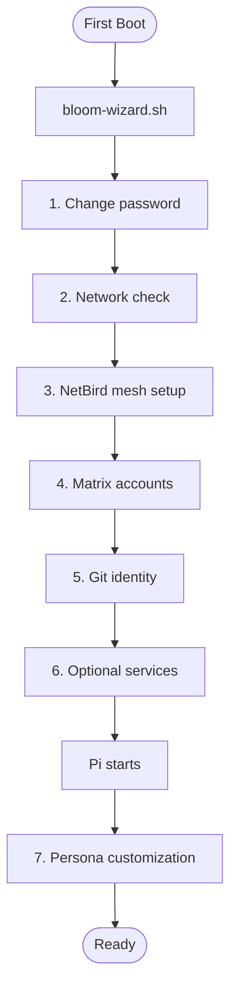

# piBloom First-Boot Setup

> [Emoji Legend](LEGEND.md)

This guide describes the first-boot experience on a freshly installed Bloom OS machine.

## Phase 1: Wizard (bash script)

The `bloom-wizard.sh` script runs automatically on first interactive login. It handles deterministic setup steps using `read -p` prompts. Each step is checkpointed — if interrupted, it resumes on next login.

1. **Password** — change the default password
2. **Network** — verify connectivity, connect to WiFi if needed
3. **NetBird** — provide a setup key from app.netbird.io
4. **Matrix** — choose a username, accounts created automatically
5. **Git identity** — name and email for commits
6. **Services** — optional dufs (WebDAV)

After completion, the wizard touches `~/.bloom/.setup-complete` and starts Pi.

## Phase 2: Pi (AI companion)

Pi starts after the wizard and guides persona customization:

7. **Persona** — Pi asks about preferences (name, formality, values, reasoning style) and updates `~/Bloom/Persona/` files

## Post-Setup

### Service management

Use Pi tools for additional services:
- `service_install(name="<service>")` — install from bundled packages
- `manifest_apply(install_missing=true)` — apply manifest declaratively
- `bridge_create(bridge="whatsapp")` — connect messaging bridges

### Health check

- `system_health` — composite health check
- `manifest_show` — show installed services
- `manifest_sync(mode="detect")` — sync manifest with actual state

## Related

- [Emoji Legend](LEGEND.md) — Notation reference
- [Quick Deploy](quick_deploy.md) — OS build and deployment
- [Fleet PR Workflow](fleet-pr-workflow.md) — Fleet contribution and PR workflow
- [AGENTS.md](../AGENTS.md) — Extension, tool, and hook reference
