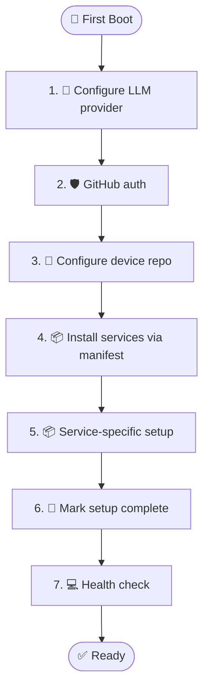

# piBloom First-Boot Setup

> 📖 [Emoji Legend](LEGEND.md)

This guide is for the first interactive session on a freshly installed Bloom OS machine.

> Important: commands like `service_install`, `manifest_apply`, `bloom_repo_configure` are **Pi tools**.
> They are not shell binaries unless explicitly wrapped by your environment.



## 0) 💻 Prerequisite

If `~/.bloom/.setup-complete` exists, first-boot was already completed.

Fresh Bloom OS images grant user `bloom` passwordless `sudo` for bootstrap operations.

## 1) 🤖 LLM provider and API key

Configure your preferred provider in Pi (OpenAI, Anthropic, etc.) and validate with a short prompt.

## 2) 🛡️ GitHub auth (for PR-based self-evolution)

```bash
gh auth login
gh auth status
```

## 3) 🤖 Configure device repo for PR flow

Use Pi tools (recommended):

1. `bloom_repo_configure(repo_url="https://github.com/pibloom/pi-bloom.git")`
2. `bloom_repo_status`
3. `bloom_repo_sync(branch="main")`

Expected local path:

- `~/.bloom/pi-bloom`

## 4) 📦 Configure optional service modules (manifest-first)

Declare desired services in `~/Bloom/manifest.yaml` via tool calls:

- `manifest_set_service(name="syncthing", image="docker.io/syncthing/syncthing@sha256:...", version="0.1.0", enabled=true)`
- `manifest_set_service(name="whatsapp", image="ghcr.io/pibloom/bloom-whatsapp:0.1.0", version="0.1.0", enabled=true)`
- `manifest_set_service(name="whisper", image="docker.io/fedirz/faster-whisper-server@sha256:...", version="0.1.0", enabled=true)`
- `manifest_set_service(name="netbird", image="docker.io/netbirdio/netbird@sha256:...", version="0.1.0", enabled=true)`

Preview:

- `manifest_apply(dry_run=true)`

Apply:

- `manifest_apply(install_missing=true)`

## 5) 📦 Service-specific follow-up

### 📦 Syncthing

Open:

- `http://localhost:8384`

If running inside QEMU dev VM, host access works via forwarded port:

- host `localhost:8384` -> guest `8384`

Alternative tunnel:

```bash
ssh -L 8384:localhost:8384 -p 2222 bloom@localhost
```

### 📦 WhatsApp

Watch logs and pair QR:

```bash
journalctl --user -u bloom-whatsapp -f
```

### 📦 NetBird

Check rootless prerequisites before first start:

- user must have entries in `/etc/subuid` and `/etc/subgid`

Then authenticate:

```bash
podman exec bloom-netbird netbird up
```

## 6) 🚀 Mark setup complete

```bash
touch ~/.bloom/.setup-complete
```

## 7) 💻 Health check

Run:

- `system_health`
- `manifest_show`
- `manifest_sync(mode="detect")`

## 🔗 Related

- [Emoji Legend](LEGEND.md) — Notation reference
- [Quick Deploy](quick_deploy.md) — OS build and deployment
- [Fleet Bootstrap Checklist](fleet-bootstrap-checklist.md) — PR-ready device setup
- [AGENTS.md](../AGENTS.md) — Extension, tool, and hook reference
