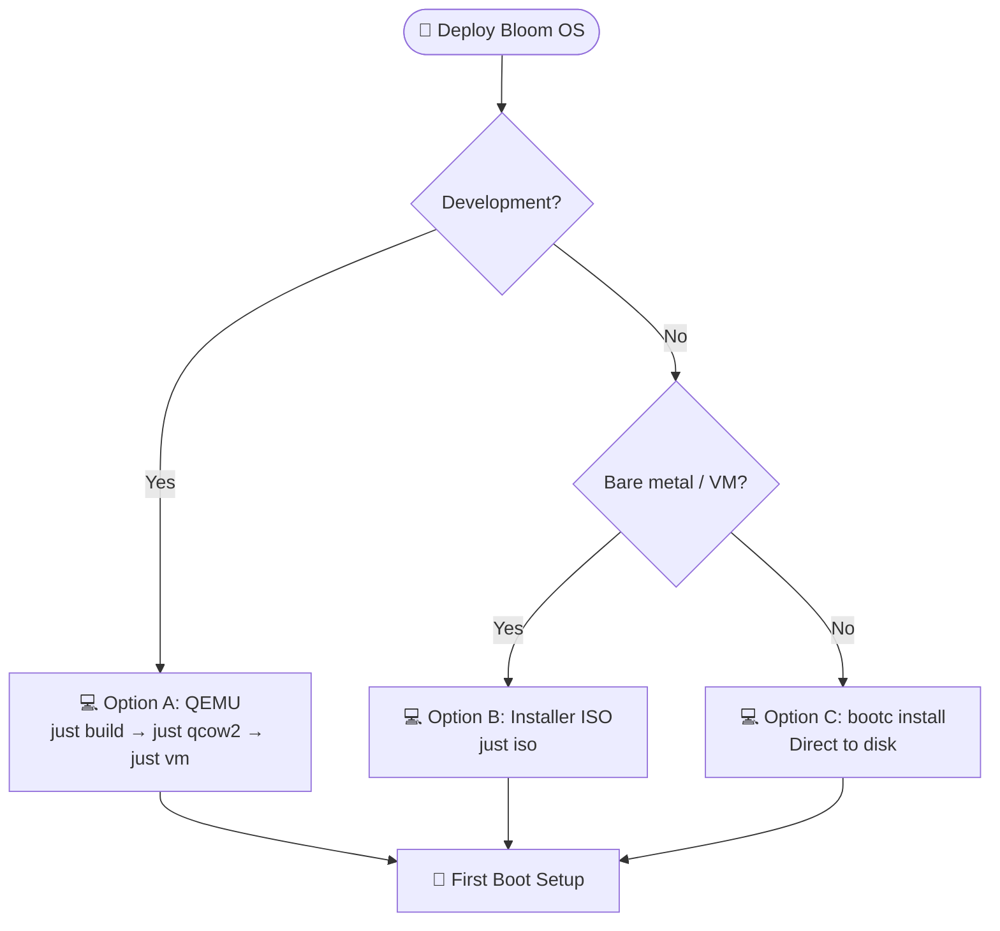

# Bloom OS Quick Deploy & Installation

> 📖 [Emoji Legend](LEGEND.md)

This guide covers the fastest dev path (QEMU) and production-style installation options.



## Option A — QEMU (fastest for development)

### 1) Install host dependencies (Fedora)

```bash
sudo dnf install -y just qemu-system-x86 edk2-ovmf podman
```

### 2) Build Bloom OS image

```bash
just build
```

### 3) Generate VM disk (qcow2)

```bash
just qcow2
```

Output:

- `os/output/qcow2/disk.qcow2`

### 4) Boot VM

```bash
just vm
```

Forwarded host ports:

- `localhost:2222 -> guest:22` (SSH)
- `localhost:5000 -> guest:5000` (dufs WebDAV)

### 5) Log in

Default user comes from `os/bib-config.toml`:

- username: `pi`
- SSH key auth: from `customizations.user.key`

If you want password auth, configure it explicitly in your bootc-image-builder config and rebuild.

### 6) Run first-boot setup

Follow the setup guide:

- `docs/pibloom-setup.md`

### 7) Stop VM

```bash
just vm-kill
```

---

## Option B — Installer ISO (VM manager / bare metal)

Build installer media:

```bash
just iso
```

Use ISO from `os/output/anaconda-iso/` as installation media.

For OTA-oriented builds targeting GHCR image refs:

```bash
just iso-production
```

---

## Option C — Direct bootc install (advanced)

After building locally, install directly to a disk:

```bash
sudo bootc install to-disk /dev/sdX --source-imgref containers-storage:localhost/bloom-os:latest
```

Replace `/dev/sdX` with the target disk.

---

## Remote access (SSH + tmux)

Bloom OS is accessed via SSH. tmux is pre-installed for persistent terminal sessions.

```bash
# SSH into your Bloom (replace with your NetBird IP or hostname)
ssh pi@<netbird-ip>

# Start or attach to a persistent tmux session
tmux new-session -A -s main
```

Pi runs in the terminal. The Sway Wayland display is available for AI computer use
(screenshots, browser automation, GUI apps). Open http://<bloom-ip>:6080 for browser-based remote desktop.

## Related

- [Emoji Legend](LEGEND.md) — Notation reference
- [First Boot Setup](pibloom-setup.md) — Initial configuration guide
- [Service Architecture](service-architecture.md) — Extensibility hierarchy details
