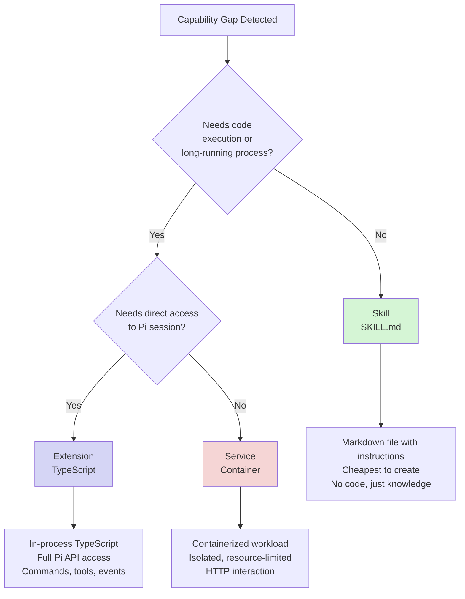
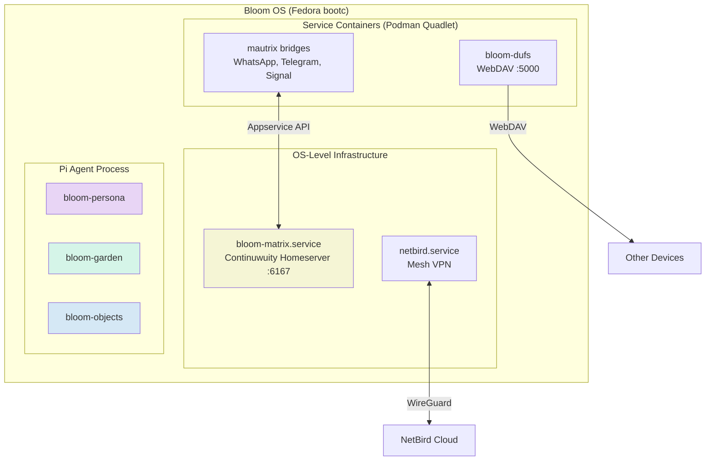
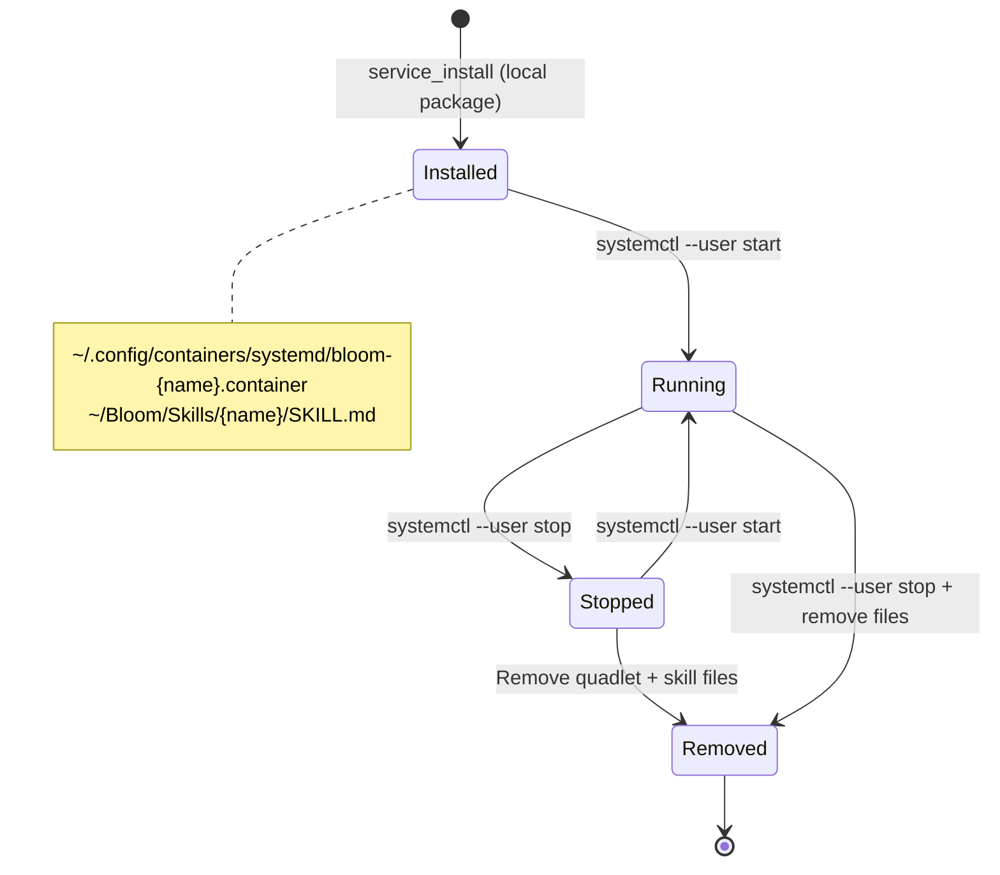
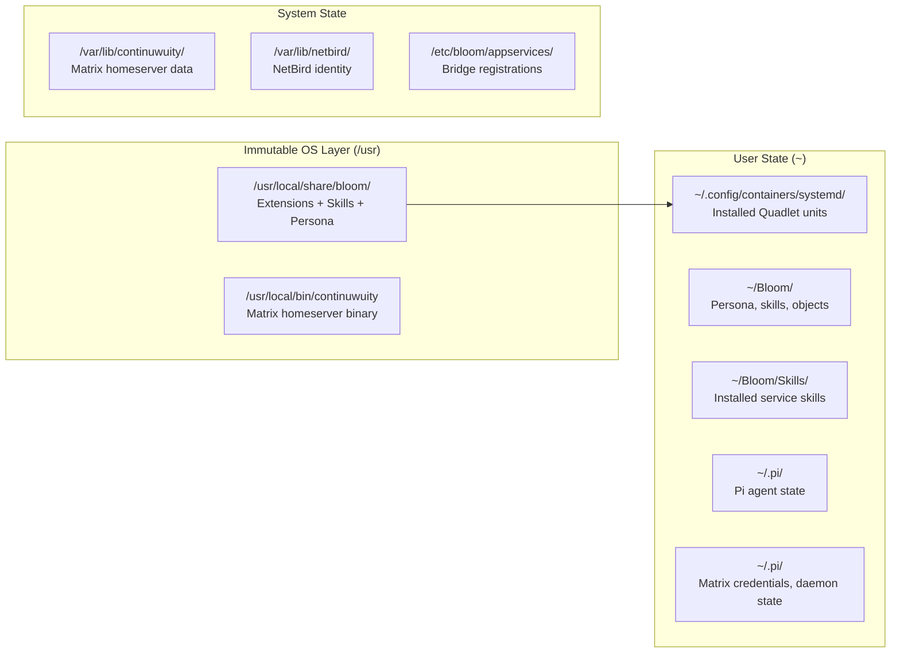

# Service Architecture

> [Emoji Legend](LEGEND.md)

Bloom extends Pi's capabilities through three mechanisms, each suited to different needs. When Pi detects a capability gap or the user requests a new feature, choose the lightest mechanism that fits.

## Extensibility Hierarchy



### When to Use What

| Mechanism | Use When | Examples | Cost |
|-----------|----------|----------|------|
| **Skill** | Pi needs knowledge or a procedure to follow | meal-planning, troubleshooting guides, API references | Zero — just a markdown file |
| **Extension** | Pi needs to register commands, tools, or react to session events | bloom-objects (object store), bloom-garden (Bloom directory) | Low — TypeScript, runs in-process |
| **Service** | A standalone process needs to run independently of Pi's session | dufs (WebDAV), mautrix bridges (WhatsApp, Telegram) | Medium — systemd unit, resource allocation |

**Always prefer the lighter option.** A skill that teaches Pi to call an existing API is better than an extension wrapping that API, which is better than a service re-implementing it.

## System Overview



## The Three Layers

| Layer | Mechanism | Lifecycle | Communication | Created By |
|-------|-----------|-----------|---------------|------------|
| **Skills** | Markdown files (SKILL.md) | Discovered at session start | Pi reads and follows instructions | Pi (via `skill_create`) or developer |
| **Extensions** | In-process TypeScript | Loaded with Pi session | Direct API (ExtensionAPI) | Developer (requires code review + PR) |
| **Services** | Containers (Podman Quadlet) | systemd-managed, independent | HTTP, Matrix appservice API | Pi (via self-evolution) or developer |

### Why Three Layers?

- **Skills** are pure knowledge — procedures, API references, troubleshooting guides. Pi reads them and acts. No code, no process, no resources. Pi can create these autonomously.
- **Extensions** need direct access to Pi's session (send messages, register commands, access context). They run in-process and require TypeScript. These are core platform code.
- **Services** are standalone workloads (file sync, messaging bridges) that run as containers.

### Subdomain Routing Layer

When a service is installed via `service_install`, Bloom automatically creates subdomain routing:

1. **NetBird DNS** — Creates an A record `{name}.bloom.mesh` pointing to the device's mesh IP in a NetBird Custom DNS Zone. Requires `NETBIRD_API_TOKEN` in `~/.config/bloom/netbird.env`.

Services use host networking and are accessible directly at `http://{name}.bloom.mesh:{port}` from any mesh peer. No reverse proxy is needed.

**Graceful degradation**: If no NetBird token is configured, DNS is skipped. Services remain accessible via the device's mesh IP and port directly.

**Idempotency**: Zone and records are checked before creation. Zone ID is cached in `~/.config/bloom/netbird-zone.json` to avoid repeated API calls.

### OS-Level Infrastructure

Some services are foundational to the system's identity and run as native systemd services baked into the OS image:

| Unit | Purpose |
|------|---------|
| `bloom-matrix.service` | Continuwuity Matrix homeserver — communication backbone |
| `netbird.service` | Mesh networking — device reachability |

These are analogous to systemd, podman, and SSH — they're part of the OS, not optional services.

### The `bloom-` Prefix

Bloom-managed services use a `bloom-` prefix on their **unit names** (e.g., `bloom-dufs`). This is a management namespace — it does NOT mean the underlying image is Bloom-specific.

| Unit Name | Type | Image / Runtime | Bloom-specific? |
|-----------|------|-----------------|-----------------|
| `bloom-dufs` | Podman Quadlet (user) | `docker.io/sigoden/dufs:latest` | No — upstream image |
| `bloom-matrix` | Native systemd service | Continuwuity binary in OS image | Part of OS |
| `netbird` | System RPM service | NetBird package | No — upstream RPM |

The prefix enables:
- `systemctl --user status bloom-*` — list all Bloom-managed user services
- Clear separation from user-installed services

## Local Package Installation

Services are installed from bundled local packages in `services/{name}/`. Each package contains Quadlet container units and a SKILL.md file.

### Package Format

```
services/{name}/
├── quadlet/
│   ├── bloom-{name}.container    # Podman Quadlet unit
│   └── bloom-{name}-*.volume     # Volume definitions
└── SKILL.md                      # Skill file (frontmatter + API docs)
```

### Service Catalog

`services/catalog.yaml` is the declarative metadata index:

- `services:` — container service defaults (version, image, preflight requirements)
- `bridges:` — mautrix bridge metadata (image, health_port)

The `manifest_apply` tool uses the services catalog to auto-install missing services and enforce preflight checks.

## Service Lifecycle



## File System Layout



## Available Services

| Service | Category | Port | Type | Resources |
|---------|----------|------|------|-----------|
| bloom-dufs | sync | 5000 | Podman Quadlet | 64MB RAM |
| bloom-matrix | communication | 6167 | Native systemd | 512MB RAM |
| netbird | networking | — | System RPM | 256MB RAM |

## Adding a New Service

1. Create `services/{name}/quadlet/bloom-{name}.container` with Quadlet conventions
2. Create `services/{name}/SKILL.md` documenting the API and usage
3. Test locally: copy to `~/.config/containers/systemd/`, reload, start
4. Update the services table in `services/README.md` and `AGENTS.md`

### Quadlet Conventions Checklist

- [ ] Container name: `bloom-{name}`
- [ ] Network: host networking
- [ ] Health check defined (`HealthCmd`, `HealthInterval`, `HealthRetries`)
- [ ] Logging: `LogDriver=journald`
- [ ] Security: `NoNewPrivileges=true`
- [ ] Restart policy: `on-failure` with `RestartSec=10`
- [ ] Resource limits set (`--memory`)
- [ ] `WantedBy=default.target` in `[Install]`

## Related

- [Emoji Legend](LEGEND.md) — Notation reference
- [Supply Chain](supply-chain.md) — Artifact trust and releases
- [Quick Deploy](quick_deploy.md) — OS build and deployment
