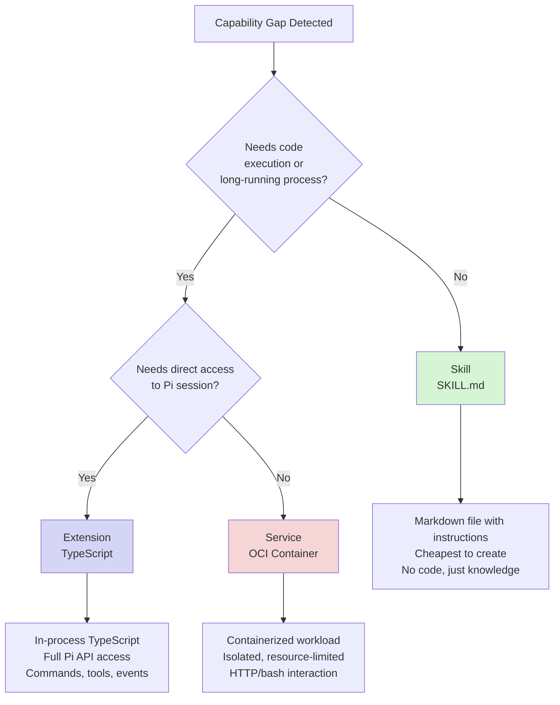
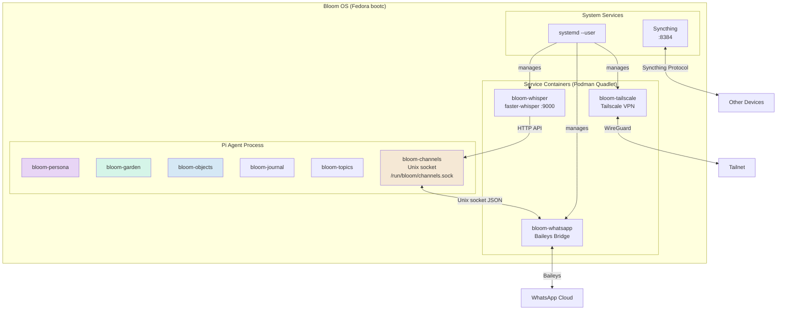
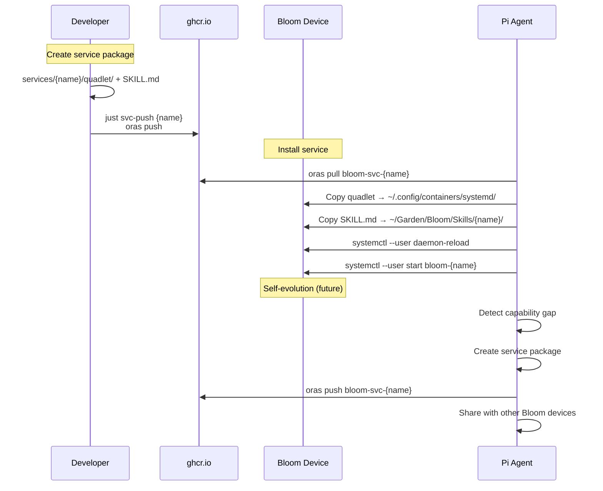
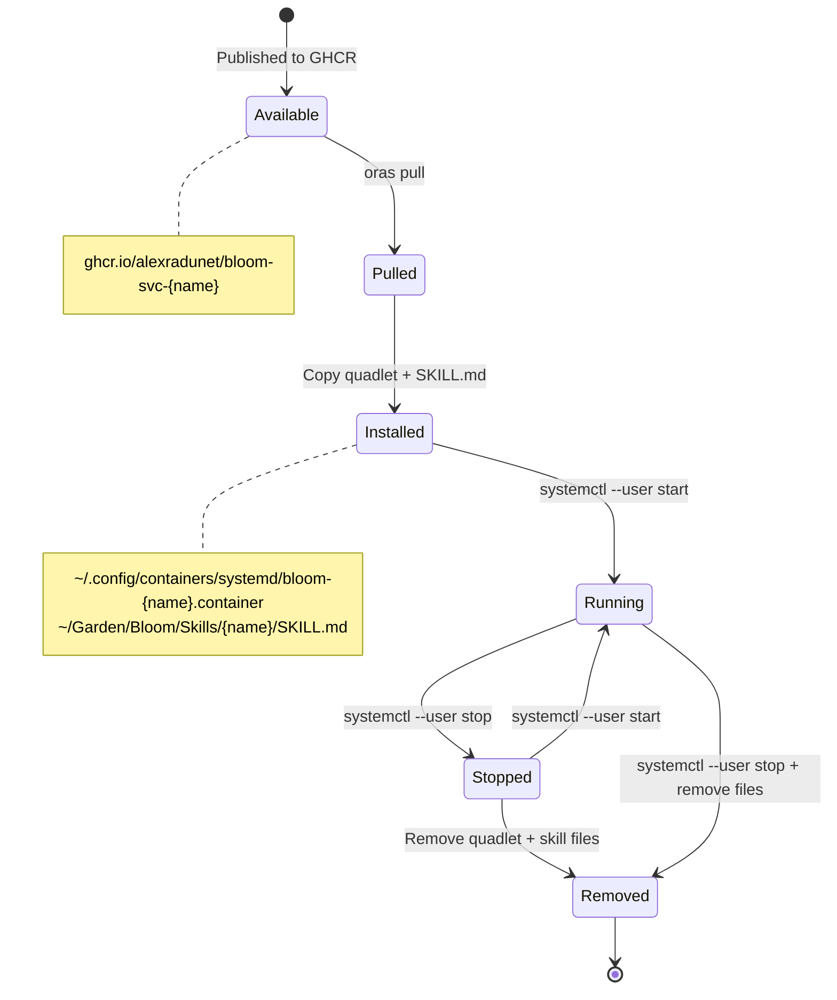
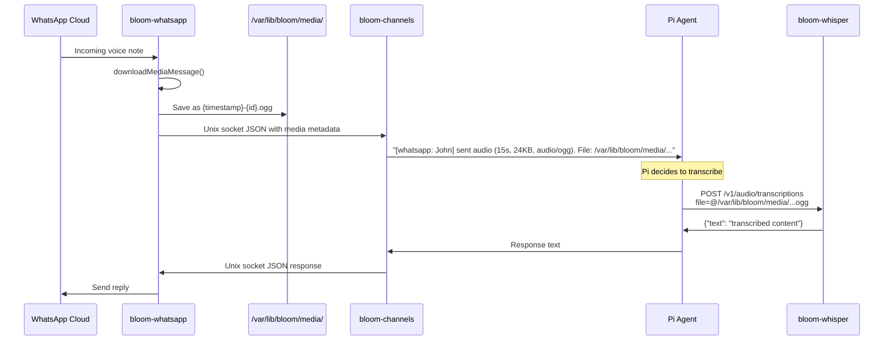
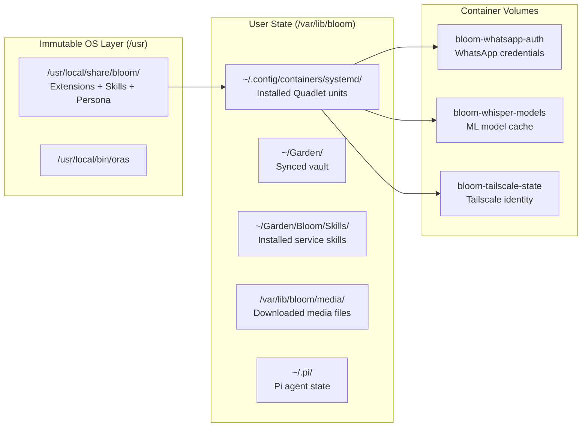

# Service Architecture

Bloom extends Pi's capabilities through three mechanisms, each suited to different needs. When Pi detects a capability gap or the user requests a new feature, choose the lightest mechanism that fits.

## Extensibility Hierarchy



### When to Use What

| Mechanism | Use When | Examples | Cost |
|-----------|----------|----------|------|
| **Skill** | Pi needs knowledge or a procedure to follow | meal-planning, troubleshooting guides, API references | Zero — just a markdown file |
| **Extension** | Pi needs to register commands, tools, or react to session events | bloom-channels (Unix socket server), bloom-journal (daily entries) | Low — TypeScript, runs in-process |
| **Service** | A standalone process needs to run independently of Pi's session | Whisper (ML model), WhatsApp bridge (always-on), Tailscale (VPN) | Medium — container image, systemd unit, resource allocation |

**Always prefer the lighter option.** A skill that teaches Pi to call an existing API is better than an extension wrapping that API, which is better than a service re-implementing it.

## System Overview



## The Three Layers

| Layer | Mechanism | Lifecycle | Communication | Created By |
|-------|-----------|-----------|---------------|------------|
| **Skills** | Markdown files (SKILL.md) | Discovered at session start | Pi reads and follows instructions | Pi (via `skill_create`) or developer |
| **Extensions** | In-process TypeScript | Loaded with Pi session | Direct API (ExtensionAPI) | Developer (requires code review + PR) |
| **Services** | OCI containers via Podman Quadlet | systemd-managed, independent | Unix socket, HTTP, shell | Pi (via self-evolution) or developer |

### Why Three Layers?

- **Skills** are pure knowledge — procedures, API references, troubleshooting guides. Pi reads them and acts. No code, no process, no resources. Pi can create these autonomously.
- **Extensions** need direct access to Pi's session (send messages, register commands, access context). They run in-process and require TypeScript. These are core platform code.
- **Services** are standalone workloads (speech-to-text, messaging bridges, VPN) that benefit from container isolation, independent updates, and resource limits. Pi can create and distribute these via OCI artifacts.

### The `bloom-` Prefix

Service containers use a `bloom-` prefix on their **Quadlet unit names** (e.g., `bloom-whisper`, `bloom-tailscale`). This is a management namespace — it does NOT mean the container image is Bloom-specific. Most services use upstream images directly:

| Quadlet Name | Container Image | Bloom-specific? |
|-------------|-----------------|-----------------|
| `bloom-whisper` | `fedirz/faster-whisper-server@sha256:760e5e43d427dc6cfbbc4731934b908b7de9c7e6d5309c6a1f0c8c923a5b6030` | No — upstream image |
| `bloom-tailscale` | `tailscale/tailscale@sha256:95e528798bebe75f39b10e74e7051cf51188ee615934f232ba7ad06a3390ffa1` | No — upstream image |
| `bloom-whatsapp` | `ghcr.io/alexradunet/bloom-whatsapp:latest` | Yes — custom bridge |

The prefix enables:
- `systemctl --user status bloom-*` — list all Bloom-managed services
- `ls ~/.config/containers/systemd/bloom-*.container` — discover installed services
- Clear separation from user-installed containers

## OCI Artifact Distribution

Service packages are distributed as OCI artifacts via GHCR, using `oras` for push/pull.



### Package Format

```
services/{name}/
├── quadlet/
│   ├── bloom-{name}.container    # Podman Quadlet unit
│   └── bloom-{name}-*.volume     # Volume definitions
└── SKILL.md                      # Skill file (frontmatter + API docs)
```

### OCI Annotations

```
org.opencontainers.image.title       = bloom-{name}
org.opencontainers.image.description = Human-readable description
org.opencontainers.image.source      = https://github.com/alexradunet/bloom
org.opencontainers.image.version     = 1.0.0
dev.bloom.service.category           = media | communication | networking
dev.bloom.service.port               = 9000
```

## Service Lifecycle



## Media Pipeline

When WhatsApp receives a voice note or image, the media flows through multiple services:



### Media Message Format (Channel Protocol)

```json
{
  "type": "message",
  "channel": "whatsapp",
  "from": "John",
  "timestamp": 1709568000,
  "media": {
    "kind": "audio",
    "mimetype": "audio/ogg",
    "filepath": "/var/lib/bloom/media/1709568000-abc123.ogg",
    "duration": 15,
    "size": 24576,
    "caption": null
  }
}
```

## File System Layout



## Available Services

| Service | Category | Port | Image | Resources |
|---------|----------|------|-------|-----------|
| bloom-whatsapp | communication | — | ghcr.io/alexradunet/bloom-whatsapp | 128MB RAM |
| bloom-whisper | media | 9000 | fedirz/faster-whisper-server@sha256:760e5e43d427dc6cfbbc4731934b908b7de9c7e6d5309c6a1f0c8c923a5b6030 | 2GB RAM |
| bloom-tailscale | networking | — | tailscale/tailscale@sha256:95e528798bebe75f39b10e74e7051cf51188ee615934f232ba7ad06a3390ffa1 | 256MB RAM |

## Adding a New Service

1. Create `services/{name}/quadlet/bloom-{name}.container` with Quadlet conventions
2. Create `services/{name}/SKILL.md` documenting the API and usage
3. Test locally: copy to `~/.config/containers/systemd/`, reload, start
4. Push to GHCR: `just svc-push {name}`
5. Update the services table in `services/README.md` and `AGENTS.md`

### Quadlet Conventions Checklist

- [ ] Container name: `bloom-{name}`
- [ ] Network: prefer `bloom.network` isolation (`host` only when required, e.g. VPN)
- [ ] Health check defined (`HealthCmd`, `HealthInterval`, `HealthRetries`)
- [ ] Logging: `LogDriver=journald`
- [ ] Security: `NoNewPrivileges=true`
- [ ] Restart policy: `on-failure` with `RestartSec=10`
- [ ] Resource limits set (`--memory`)
- [ ] `WantedBy=default.target` in `[Install]`
