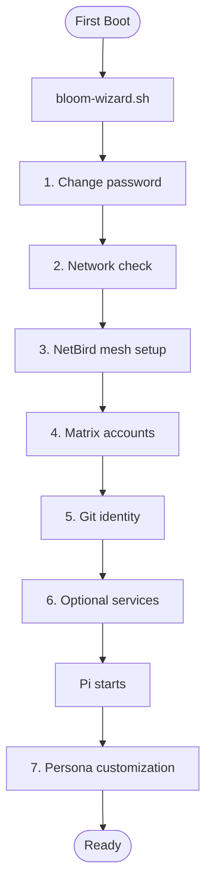

# First-Boot Wizard Implementation Plan

> **For agentic workers:** REQUIRED: Use superpowers:subagent-driven-development (if subagents available) or superpowers:executing-plans to implement this plan. Steps use checkbox (`- [ ]`) syntax for tracking.

**Goal:** Move deterministic first-boot setup steps from Pi's LLM-guided flow into a standalone bash wizard script, keeping Pi for persona customization only.

**Architecture:** A bash script (`bloom-wizard.sh`) with step checkpointing runs on first login before Pi starts. It handles password, network, NetBird, Matrix, git, and services. The bloom-setup extension is simplified to 2 steps (persona + complete). NetBird DNS routing is removed entirely.

**Tech Stack:** Bash, curl (Matrix API), systemctl, nmcli, netbird CLI

**Spec:** `docs/superpowers/specs/2026-03-12-first-boot-wizard-design.md`

---

## Chunk 1: Delete Dead Code & Remove NetBird DNS Feature

### Task 1: Delete `lib/netbird.ts` and its tests

**Files:**
- Delete: `lib/netbird.ts`
- Delete: `tests/lib/netbird.test.ts`

- [ ] **Step 1: Delete the files**

```bash
rm lib/netbird.ts tests/lib/netbird.test.ts
```

- [ ] **Step 2: Run tests to verify nothing else breaks**

Run: `npm run test`
Expected: All tests pass (the deleted test file is no longer collected). If any other test imports from `netbird.js`, it will fail — fix in next task.

- [ ] **Step 3: Commit**

```bash
git add -u lib/netbird.ts tests/lib/netbird.test.ts
git commit -m "chore: delete lib/netbird.ts and tests — DNS routing feature removed"
```

### Task 2: Delete `lib/service-routing.ts` and its tests

**Files:**
- Delete: `lib/service-routing.ts`
- Delete: `tests/lib/service-routing.test.ts`

- [ ] **Step 1: Delete the files**

```bash
rm lib/service-routing.ts tests/lib/service-routing.test.ts
```

- [ ] **Step 2: Run tests — expect failure in actions-install**

Run: `npm run build`
Expected: FAIL — `extensions/bloom-services/actions-install.ts` imports `ensureServiceRouting` from the deleted module.

- [ ] **Step 3: Remove service routing from actions-install.ts**

In `extensions/bloom-services/actions-install.ts`:

Remove the import line:
```typescript
import { ensureServiceRouting } from "../../lib/service-routing.js";
```

Remove the routing call in `installDependency()` (around lines 72-75):
```typescript
	if (depCatalog?.port) {
		const depRouting = await ensureServiceRouting(dep, signal);
		if (!depRouting.ok && !depRouting.skipped) log.warn("dep DNS record failed", { dep, error: depRouting.error });
	}
```

Remove the routing call in `handleInstall()` (around lines 142-146):
```typescript
	// Set up DNS routing if port is defined
	if (catalogEntry?.port) {
		const routing = await ensureServiceRouting(params.name, signal);
		if (!routing.ok && !routing.skipped) log.warn("DNS record failed", { service: params.name, error: routing.error });
	}
```

- [ ] **Step 4: Build and test**

Run: `npm run build && npm run test`
Expected: PASS

- [ ] **Step 5: Commit**

```bash
git add -u
git commit -m "chore: delete lib/service-routing.ts — remove DNS routing from service install"
```

### Task 3: Run lint check

- [ ] **Step 1: Run biome check**

Run: `npm run check`
Expected: PASS. If there are lint issues from the removals, run `npm run check:fix`.

- [ ] **Step 2: Commit if fixes were needed**

```bash
git add -u
git commit -m "chore: fix lint after netbird/routing removal"
```

---

## Chunk 2: Simplify bloom-setup Extension

### Task 4: Simplify `lib/setup.ts` to 2 steps

**Files:**
- Modify: `lib/setup.ts`
- Modify: `tests/lib/setup.test.ts`

- [ ] **Step 1: Update tests first**

Rewrite `tests/lib/setup.test.ts`:

```typescript
import { describe, expect, it } from "vitest";
import {
	advanceStep,
	createInitialState,
	getNextStep,
	getStepsSummary,
	isSetupComplete,
	STEP_ORDER,
} from "../../lib/setup.js";

describe("createInitialState", () => {
	it("creates state with all steps pending", () => {
		const state = createInitialState();
		expect(state.version).toBe(1);
		expect(state.startedAt).toBeTruthy();
		expect(state.completedAt).toBeNull();
		for (const step of STEP_ORDER) {
			expect(state.steps[step].status).toBe("pending");
		}
	});

	it("has exactly 2 steps", () => {
		const state = createInitialState();
		expect(Object.keys(state.steps)).toHaveLength(2);
	});
});

describe("getNextStep", () => {
	it("returns 'persona' for fresh state", () => {
		const state = createInitialState();
		expect(getNextStep(state)).toBe("persona");
	});

	it("returns 'complete' when persona is done", () => {
		const state = createInitialState();
		state.steps.persona = { status: "completed", at: new Date().toISOString() };
		expect(getNextStep(state)).toBe("complete");
	});

	it("returns null when all steps are done", () => {
		const state = createInitialState();
		for (const step of STEP_ORDER) {
			state.steps[step] = { status: "completed", at: new Date().toISOString() };
		}
		expect(getNextStep(state)).toBeNull();
	});
});

describe("advanceStep", () => {
	it("marks step as completed", () => {
		const state = createInitialState();
		const next = advanceStep(state, "persona", "completed");
		expect(next.steps.persona.status).toBe("completed");
		expect(next.steps.persona.at).toBeTruthy();
	});

	it("marks step as skipped with reason", () => {
		const state = createInitialState();
		const next = advanceStep(state, "persona", "skipped", "user declined");
		expect(next.steps.persona.status).toBe("skipped");
		expect(next.steps.persona.reason).toBe("user declined");
	});

	it("sets completedAt when last step is completed", () => {
		const state = createInitialState();
		state.steps.persona = { status: "completed", at: new Date().toISOString() };
		const next = advanceStep(state, "complete", "completed");
		expect(next.completedAt).toBeTruthy();
	});

	it("does not mutate original state", () => {
		const state = createInitialState();
		const next = advanceStep(state, "persona", "completed");
		expect(state.steps.persona.status).toBe("pending");
		expect(next.steps.persona.status).toBe("completed");
	});
});

describe("isSetupComplete", () => {
	it("returns false for fresh state", () => {
		expect(isSetupComplete(createInitialState())).toBe(false);
	});

	it("returns true when completedAt is set", () => {
		const state = createInitialState();
		state.completedAt = new Date().toISOString();
		expect(isSetupComplete(state)).toBe(true);
	});
});

describe("getStepsSummary", () => {
	it("returns summary of all steps", () => {
		const state = createInitialState();
		state.steps.persona = { status: "completed", at: new Date().toISOString() };
		const summary = getStepsSummary(state);
		expect(summary).toHaveLength(2);
		expect(summary[0]).toEqual({ name: "persona", status: "completed" });
		expect(summary[1]).toEqual({ name: "complete", status: "pending" });
	});
});
```

- [ ] **Step 2: Run test to verify it fails**

Run: `npm run test -- tests/lib/setup.test.ts`
Expected: FAIL — still has 11 steps.

- [ ] **Step 3: Update `lib/setup.ts`**

Replace `STEP_ORDER` to only include the two Pi-handled steps:

```typescript
/** Step names in execution order. */
export const STEP_ORDER = ["persona", "complete"] as const;
```

No other changes needed — the rest of the file (`StepName`, `StepState`, `SetupState`, `createInitialState`, `getNextStep`, `advanceStep`, `isSetupComplete`, `getStepsSummary`) all derive from `STEP_ORDER` and work with any number of steps.

- [ ] **Step 4: Run tests**

Run: `npm run test -- tests/lib/setup.test.ts`
Expected: PASS

- [ ] **Step 5: Commit**

```bash
git add lib/setup.ts tests/lib/setup.test.ts
git commit -m "refactor: simplify setup steps to persona + complete (wizard handles the rest)"
```

### Task 5: Simplify `extensions/bloom-setup/step-guidance.ts`

**Files:**
- Modify: `extensions/bloom-setup/step-guidance.ts`

- [ ] **Step 1: Replace step guidance with only persona + complete**

```typescript
/**
 * Step guidance constants for bloom-setup.
 * Defines what Pi should say/do at each first-boot setup step.
 */
import type { StepName } from "../../lib/setup.js";

/** Step guidance — what Pi should say/do at each step. */
export const STEP_GUIDANCE: Record<StepName, string> = {
	persona:
		"Guide the user through personalizing their AI companion. Ask one question at a time: SOUL — 'What should I call you?', 'How formal or casual should I be?', 'Any values important to you?'. BODY — 'Same style everywhere, or different for Matrix vs terminal?'. FACULTY — 'Step-by-step thinker or quick and direct?'. Update ~/Bloom/Persona/ files with their preferences. Fully skippable.",
	complete:
		"Congratulate the user! Setup is complete. Mention they can chat here on the terminal or on their connected messaging channel. Let them know Pi is always running in the background — even when they log out, Pi stays connected to Matrix rooms and responds to messages. When they log in interactively, they get a separate terminal session while the daemon keeps running in parallel. Both share the same persona and filesystem. Remind them they can revisit any setup step by asking.",
};
```

- [ ] **Step 2: Build**

Run: `npm run build`
Expected: PASS

- [ ] **Step 3: Commit**

```bash
git add extensions/bloom-setup/step-guidance.ts
git commit -m "refactor: simplify step guidance — keep only persona + complete"
```

### Task 6: Simplify `extensions/bloom-setup/actions.ts`

**Files:**
- Modify: `extensions/bloom-setup/actions.ts`

- [ ] **Step 1: Simplify `touchSetupComplete()`**

The wizard now handles touching `~/.bloom/.setup-complete`, enabling linger, and starting pi-daemon. The extension's `touchSetupComplete()` only needs to write the `persona-done` marker.

Replace the `touchSetupComplete` function:

```typescript
/** Mark persona customization as complete (wizard already handled OS-level setup). */
export async function touchPersonaDone(): Promise<void> {
	const markerPath = join(os.homedir(), ".bloom", "wizard-state", "persona-done");
	const dir = dirname(markerPath);
	if (!existsSync(dir)) mkdirSync(dir, { recursive: true, mode: 0o700 });
	writeFileSync(markerPath, new Date().toISOString(), "utf-8");
	log.info("persona customization complete");
}
```

Update `handleSetupAdvance` to call `touchPersonaDone()` **when the "persona" step is advanced** (not when all steps are complete). This ensures re-login between persona and complete steps works correctly:

```typescript
export async function handleSetupAdvance(params: { step: StepName; result: "completed" | "skipped"; reason?: string }) {
	let state = loadState();
	const { step, result } = params;
	state = advanceStep(state, step, result, params.reason);
	saveState(state);

	// Write persona-done marker as soon as persona step completes
	if (step === "persona") {
		await touchPersonaDone();
	}

	// ... rest of the function unchanged (next step guidance, etc.)
```

Remove the `run` import from `"../../lib/exec.js"` since it's no longer needed.

- [ ] **Step 2: Update `index.ts` — check for persona-done marker**

In `extensions/bloom-setup/index.ts`, update the `before_agent_start` hook to check the persona-done marker:

```typescript
import { existsSync } from "node:fs";
import os from "node:os";
import { join } from "node:path";
```

Update the hook (flat early-return pattern for clarity):

```typescript
	pi.on("before_agent_start", async (event) => {
		if (!isSetupDone()) return; // wizard hasn't run yet
		const personaDone = join(os.homedir(), ".bloom", "wizard-state", "persona-done");
		if (existsSync(personaDone)) return; // persona already done

		const setupPrompt = getSetupSystemPrompt();
		if (setupPrompt) {
			return { systemPrompt: `${setupPrompt}\n\n${event.systemPrompt}` };
		}
	});
```

- [ ] **Step 3: Build and test**

Run: `npm run build && npm run test`
Expected: PASS

- [ ] **Step 4: Commit**

```bash
git add extensions/bloom-setup/actions.ts extensions/bloom-setup/index.ts
git commit -m "refactor: simplify bloom-setup — wizard handles OS setup, extension tracks persona only"
```

### Task 7: Rewrite `skills/first-boot/SKILL.md`

**Files:**
- Modify: `skills/first-boot/SKILL.md`

- [ ] **Step 1: Rewrite the skill to cover only persona + welcome**

```markdown
---
name: first-boot
description: Post-wizard persona customization — Pi helps the user personalize their Bloom experience
---

# First-Boot: Persona Customization

## Prerequisite

The bash wizard (`bloom-wizard.sh`) has already completed OS-level setup: password, network, NetBird, Matrix, git identity, and services. The sentinel file `~/.bloom/.setup-complete` exists.

If `~/.bloom/wizard-state/persona-done` exists, persona customization is also done. Skip this skill entirely. You can still help the user reconfigure their persona if they ask.

## How This Works

You are paired with the `bloom-setup` extension which tracks state in `~/.bloom/setup-state.json`. Your role is conversational guidance; the extension handles state.

1. Call `setup_status()` to see where you are
2. Follow the guidance for the current step
3. After completing a step, call `setup_advance(step, "completed")`
4. If the user says "skip", call `setup_advance(step, "skipped", "reason")`
5. Repeat until all steps are done

## Conversation Style

- **Warm and natural** — this is the user's first conversation with their AI companion
- **One thing at a time** — never dump a list of steps
- **Pi speaks first** — start with a welcome and orient the user
- **Respect "skip"** — persona customization is fully optional
- **Teach the shell** — mention that `!command` runs a command directly and `!!` opens an interactive shell

## Steps

### persona
Ask one question, wait for answer, update the file, ask next question. Files to update:
- `~/Bloom/Persona/SOUL.md` — name, formality, values
- `~/Bloom/Persona/BODY.md` — channel preferences
- `~/Bloom/Persona/FACULTY.md` — reasoning style

### complete
Congratulate the user. Mention they can chat on terminal or via Matrix. Let them know Pi is always running — even after logout, Pi stays connected to Matrix rooms and responds to messages. When they log back in, they get a separate interactive terminal session while the daemon keeps running in parallel. Both share the same persona and filesystem.
```

- [ ] **Step 2: Commit**

```bash
git add skills/first-boot/SKILL.md
git commit -m "docs: rewrite first-boot skill — now covers persona customization only"
```

---

## Chunk 3: Create the Wizard Script

### Task 8: Create `bloom-wizard.sh` — scaffold and checkpoint helpers

**Files:**
- Create: `os/system_files/usr/local/bin/bloom-wizard.sh`

- [ ] **Step 1: Create the script with scaffold, helpers, and step stubs**

```bash
#!/usr/bin/env bash
# bloom-wizard.sh — First-boot setup wizard for Bloom OS.
# Runs on first login before Pi starts. Uses read -p prompts.
# Each completed step writes a checkpoint to ~/.bloom/wizard-state/.
# If interrupted (Ctrl+C), resumes from the last incomplete step on next login.
set -euo pipefail

WIZARD_STATE="$HOME/.bloom/wizard-state"
SETUP_COMPLETE="$HOME/.bloom/.setup-complete"
BLOOM_DIR="${BLOOM_DIR:-$HOME/Bloom}"
BLOOM_SERVICES="/usr/local/share/bloom/services"
QUADLET_DIR="$HOME/.config/containers/systemd"
SYSTEMD_USER_DIR="$HOME/.config/systemd/user"
BLOOM_CONFIG="$HOME/.config/bloom"
PI_DIR="$HOME/.pi"
MATRIX_HOMESERVER="http://localhost:6167"

# --- Checkpoint helpers ---

step_done() { [[ -f "$WIZARD_STATE/$1" ]]; }

mark_done() {
	mkdir -p "$WIZARD_STATE"
	echo "$(date -Iseconds)" > "$WIZARD_STATE/$1"
}

# Store data alongside a checkpoint (e.g., mesh IP)
mark_done_with() {
	mkdir -p "$WIZARD_STATE"
	printf '%s\n%s\n' "$(date -Iseconds)" "$2" > "$WIZARD_STATE/$1"
}

# Read stored data from a checkpoint (line 2+)
read_checkpoint_data() {
	[[ -f "$WIZARD_STATE/$1" ]] && sed -n '2p' "$WIZARD_STATE/$1" || echo ""
}

# --- Matrix helpers ---

# Generate a secure random password (base64url, 32 chars)
generate_password() {
	openssl rand -base64 24 | tr '+/' '-_'
}

# Register a Matrix account via the UIA flow.
# Usage: matrix_register <username> <password> <registration_token>
# Outputs: JSON with user_id and access_token on success, exits 1 on failure
matrix_register() {
	local username="$1" password="$2" reg_token="$3"
	local url="${MATRIX_HOMESERVER}/_matrix/client/v3/register"

	# Step 1: POST with empty auth — expect 401 with session ID (or 200 if no UIA)
	local step1
	step1=$(curl -s -X POST "$url" \
		-H "Content-Type: application/json" \
		-d "{\"username\":\"${username}\",\"password\":\"${password}\",\"auth\":{},\"inhibit_login\":false}")

	# If step1 succeeded directly (no UIA needed), return it
	if echo "$step1" | grep -q '"access_token"'; then
		echo "$step1"
		return 0
	fi

	# Extract session from 401 response body
	local session
	session=$(json_field "$step1" "session")

	if [[ -z "$session" ]]; then
		echo "ERROR: Failed to get session ID from Matrix server" >&2
		return 1
	fi

	# Step 2: POST with registration token
	local step2
	step2=$(curl -s -X POST "$url" \
		-H "Content-Type: application/json" \
		-d "{\"username\":\"${username}\",\"password\":\"${password}\",\"inhibit_login\":false,\"auth\":{\"type\":\"m.login.registration_token\",\"token\":\"${reg_token}\",\"session\":\"${session}\"}}")

	if ! echo "$step2" | grep -q '"access_token"'; then
		echo "ERROR: Matrix registration failed for ${username}" >&2
		return 1
	fi

	echo "$step2"
	return 0
}

# Extract a JSON string field value (simple — no jq dependency)
# Usage: json_field '{"key":"value"}' "key" → value
json_field() {
	echo "$1" | sed -n "s/.*\"$2\"[[:space:]]*:[[:space:]]*\"\([^\"]*\)\".*/\1/p"
}

# --- Service install helper ---

# Install a service from the bundled package.
# Usage: install_service <name>
install_service() {
	local name="$1"
	local svc_dir="${BLOOM_SERVICES}/${name}"

	if [[ ! -d "$svc_dir" ]]; then
		echo "  Service package not found: ${svc_dir}" >&2
		return 1
	fi

	# Copy quadlet files (route .socket and .container to different dirs)
	mkdir -p "$QUADLET_DIR" "$SYSTEMD_USER_DIR"
	for f in "$svc_dir/quadlet/"*; do
		[[ -f "$f" ]] || continue
		case "$f" in
			*.socket) cp "$f" "$SYSTEMD_USER_DIR/" ;;
			*)        cp "$f" "$QUADLET_DIR/" ;;
		esac
	done

	# Copy config files (.json, .toml)
	mkdir -p "$BLOOM_CONFIG"
	for f in "$svc_dir"/*.json "$svc_dir"/*.toml; do
		[[ -f "$f" ]] || continue
		local basename
		basename=$(basename "$f")
		[[ -f "$BLOOM_CONFIG/$basename" ]] && continue
		cp "$f" "$BLOOM_CONFIG/$basename"
	done

	# Create empty env file if missing
	[[ -f "$BLOOM_CONFIG/${name}.env" ]] || touch "$BLOOM_CONFIG/${name}.env"

	# Copy SKILL.md
	local skill_dir="$BLOOM_DIR/Skills/${name}"
	mkdir -p "$skill_dir"
	[[ -f "$svc_dir/SKILL.md" ]] && cp "$svc_dir/SKILL.md" "$skill_dir/"

	# Enable and start
	systemctl --user daemon-reload
	local target="bloom-${name}.service"
	# Prefer socket activation if socket unit exists
	[[ -f "$SYSTEMD_USER_DIR/bloom-${name}.socket" ]] && target="bloom-${name}.socket"
	systemctl --user enable --now "$target"
}

# --- Step functions ---

step_welcome() {
	echo ""
	echo "Welcome to Bloom OS."
	echo "Let's configure your device. This takes a few minutes."
	echo "Press Ctrl+C at any time to abort — you'll resume where you left off next login."
	echo ""
	mark_done welcome
}

step_password() {
	echo "--- Password ---"
	echo "First, let's change the default password."
	echo ""
	while ! passwd; do
		echo ""
		echo "Password change failed. Please try again."
	done
	mark_done password
}

step_network() {
	echo ""
	echo "--- Network ---"
	if ping -c1 -W5 1.1.1.1 &>/dev/null; then
		echo "Network connected."
		mark_done network
		return
	fi

	echo "No network connection detected."
	while true; do
		read -rp "WiFi SSID: " ssid
		read -rsp "WiFi password: " psk
		echo ""
		echo "Connecting to ${ssid}..."
		if nmcli device wifi connect "$ssid" password "$psk" 2>/dev/null; then
			if ping -c1 -W5 1.1.1.1 &>/dev/null; then
				echo "Connected."
				mark_done network
				return
			fi
		fi
		echo "Connection failed. Try again."
	done
}

step_netbird() {
	echo ""
	echo "--- NetBird Mesh Network ---"
	echo "NetBird creates a private mesh network so you can access this device from anywhere."
	echo "You'll need a setup key from your NetBird dashboard (app.netbird.io → Setup Keys)."
	echo ""

	while true; do
		read -rp "Setup key: " setup_key
		if [[ -z "$setup_key" ]]; then
			echo "Setup key cannot be empty."
			continue
		fi

		echo "Connecting to NetBird..."
		if sudo netbird up --setup-key "$setup_key" 2>&1; then
			# Wait a moment for connection to establish
			sleep 3
			local status
			status=$(netbird status 2>/dev/null || true)

			if echo "$status" | grep -q "Connected"; then
				local mesh_ip
				mesh_ip=$(echo "$status" | grep -oP 'NetBird IP:\s+\K[\d.]+' || true)
				if [[ -n "$mesh_ip" ]]; then
					echo ""
					echo "Connected! Mesh IP: ${mesh_ip}"
					mark_done_with netbird "$mesh_ip"
					return
				fi
			fi
		fi

		echo ""
		echo "NetBird connection failed. Check your setup key and try again."
	done
}

step_matrix() {
	echo ""
	echo "--- Matrix Messaging ---"
	echo "Setting up Matrix messaging..."
	echo ""

	# Wait for Matrix homeserver
	echo "Waiting for Matrix homeserver..."
	local attempts=0
	while ! systemctl is-active --quiet bloom-matrix.service; do
		attempts=$((attempts + 1))
		if [[ $attempts -ge 30 ]]; then
			echo "ERROR: bloom-matrix.service did not start within 30 seconds." >&2
			echo "Run 'systemctl status bloom-matrix' to debug." >&2
			return 1
		fi
		sleep 1
	done
	echo "Matrix homeserver is running."

	# Read registration token
	local reg_token
	reg_token=$(sudo cat /var/lib/continuwuity/registration_token 2>/dev/null || true)
	if [[ -z "$reg_token" ]]; then
		echo "ERROR: Could not read registration token." >&2
		return 1
	fi

	# Prompt for username
	local username
	while true; do
		read -rp "Choose a username for your Matrix account (cannot be changed later): " username
		if [[ -z "$username" ]]; then
			echo "Username cannot be empty."
			continue
		fi
		if [[ ! "$username" =~ ^[a-z][a-z0-9._-]*$ ]]; then
			echo "Username must start with a lowercase letter and contain only a-z, 0-9, '.', '_', '-'."
			continue
		fi
		break
	done

	# Generate passwords
	local bot_password user_password
	bot_password=$(generate_password)
	user_password=$(generate_password)

	# Register bot account
	echo "Creating Pi bot account..."
	local bot_result
	bot_result=$(matrix_register "pi" "$bot_password" "$reg_token") || {
		echo "ERROR: Failed to register @pi:bloom bot account." >&2
		return 1
	}
	local bot_token bot_user_id
	bot_token=$(json_field "$bot_result" "access_token")
	bot_user_id=$(json_field "$bot_result" "user_id")

	# Register user account
	echo "Creating your account (@${username}:bloom)..."
	local user_result
	user_result=$(matrix_register "$username" "$user_password" "$reg_token") || {
		echo "ERROR: Failed to register @${username}:bloom account." >&2
		return 1
	}
	local user_token user_user_id
	user_token=$(json_field "$user_result" "access_token")
	user_user_id=$(json_field "$user_result" "user_id")

	# Store credentials
	mkdir -p "$PI_DIR"
	cat > "$PI_DIR/matrix-credentials.json" <<-CREDS
	{
	  "homeserver": "${MATRIX_HOMESERVER}",
	  "botUserId": "${bot_user_id}",
	  "botAccessToken": "${bot_token}",
	  "botPassword": "${bot_password}",
	  "userUserId": "${user_user_id}",
	  "userPassword": "${user_password}",
	  "registrationToken": "${reg_token}"
	}
	CREDS
	chmod 600 "$PI_DIR/matrix-credentials.json"

	# Create #general:bloom room (bot creates, invites user)
	echo "Creating #general:bloom room..."
	curl -sf -X POST "${MATRIX_HOMESERVER}/_matrix/client/v3/createRoom" \
		-H "Authorization: Bearer ${bot_token}" \
		-H "Content-Type: application/json" \
		-d "{\"room_alias_name\":\"general\",\"invite\":[\"${user_user_id}\"]}" \
		>/dev/null 2>&1 || echo "  (room may already exist)"

	# User joins the room
	curl -sf -X POST "${MATRIX_HOMESERVER}/_matrix/client/v3/join/%23general%3Abloom" \
		-H "Authorization: Bearer ${user_token}" \
		-H "Content-Type: application/json" \
		-d '{}' \
		>/dev/null 2>&1 || true

	echo ""
	echo "Matrix ready."
	echo "  Username: ${username}"
	echo "  Password: ${user_password}"
	echo ""
	mark_done_with matrix "$username"
}

step_git() {
	echo ""
	echo "--- Git Identity ---"
	read -rp "Your name: " git_name
	read -rp "Email: " git_email

	[[ -n "$git_name" ]] && git config --global user.name "$git_name"
	[[ -n "$git_email" ]] && git config --global user.email "$git_email"

	echo "Git identity configured."
	mark_done git
}

step_services() {
	echo ""
	echo "--- Optional Services ---"
	local installed=""

	read -rp "Install dufs file server? (access files from any device via WebDAV) [y/N]: " dufs_answer
	if [[ "${dufs_answer,,}" == "y" ]]; then
		echo "  Installing dufs..."
		if install_service dufs; then
			echo "  dufs installed."
			installed="${installed} dufs"
		else
			echo "  dufs installation failed."
		fi
	fi

	read -rp "Install Cinny Matrix client? (web-based Matrix chat) [y/N]: " cinny_answer
	if [[ "${cinny_answer,,}" == "y" ]]; then
		echo "  Installing Cinny..."
		if install_service cinny; then
			echo "  Cinny installed."
			installed="${installed} cinny"
		else
			echo "  Cinny installation failed."
		fi
	fi

	mark_done_with services "${installed:-none}"
}

# --- Finalization ---

finalize() {
	touch "$SETUP_COMPLETE"
	loginctl enable-linger "$USER"
	systemctl --user enable --now pi-daemon.service 2>/dev/null || true

	local mesh_ip
	mesh_ip=$(read_checkpoint_data netbird)
	local matrix_user
	matrix_user=$(read_checkpoint_data matrix)
	local services
	services=$(read_checkpoint_data services)

	echo ""
	echo "========================================="
	echo "  Setup complete!"
	echo ""
	[[ -n "$mesh_ip" ]] && echo "  Mesh IP: ${mesh_ip} (access from any NetBird peer)"
	[[ -n "$matrix_user" ]] && echo "  Matrix user: @${matrix_user}:bloom"
	echo "  Services:${services:-none}"
	echo ""
	echo "  Starting Pi — your AI companion will"
	echo "  help you personalize your experience."
	echo "========================================="
	echo ""
}

# --- Main ---

main() {
	if [[ -f "$SETUP_COMPLETE" ]]; then
		return 0
	fi

	if [[ -d "$WIZARD_STATE" ]] && ls "$WIZARD_STATE"/* &>/dev/null; then
		echo "Resuming setup..."
	fi

	step_done welcome  || step_welcome
	step_done password || step_password
	step_done network  || step_network
	step_done netbird  || step_netbird
	step_done matrix   || step_matrix
	step_done git      || step_git
	step_done services || step_services

	finalize
}

main
```

- [ ] **Step 2: Make it executable**

```bash
chmod +x os/system_files/usr/local/bin/bloom-wizard.sh
```

- [ ] **Step 3: Commit**

```bash
git add os/system_files/usr/local/bin/bloom-wizard.sh
git commit -m "feat: add bloom-wizard.sh — bash first-boot setup wizard with step checkpointing"
```

---

## Chunk 4: Integration & Docs

### Task 9: Update `.bash_profile` to run wizard before Zellij

**Files:**
- Modify: `os/system_files/etc/skel/.bash_profile`

- [ ] **Step 1: Rewrite `.bash_profile`**

```bash
# Source .bashrc for env vars (BLOOM_DIR, PATH, etc.)
[ -f ~/.bashrc ] && . ~/.bashrc

# First-boot wizard (runs once, before Pi — must run BEFORE Zellij since exec replaces shell)
if [ -t 0 ] && [ ! -f "$HOME/.bloom/.setup-complete" ]; then
  /usr/local/bin/bloom-wizard.sh
fi

# Auto-launch Zellij on interactive SSH login (skip if escape hatch or already inside Zellij)
# Guards: interactive TTY, SSH session, not already in Zellij, no escape hatch env var
if [ -t 0 ] && [ -n "$SSH_CONNECTION" ] && [ -z "$ZELLIJ" ] && [ -z "$BLOOM_NO_ZELLIJ" ]; then
  if zellij list-sessions 2>/dev/null | grep -q '^bloom$'; then
    exec zellij attach bloom
  else
    exec zellij -s bloom -l bloom
  fi
fi

# Start Pi on interactive login (only one instance — atomic mkdir lock)
# The pi-daemon runs independently via systemd — no stop/start needed.
if [ -t 0 ] && [ -z "$PI_SESSION" ] && mkdir /tmp/.bloom-pi-session 2>/dev/null; then
  trap 'rmdir /tmp/.bloom-pi-session 2>/dev/null' EXIT
  export PI_SESSION=1
  /usr/local/bin/bloom-greeting.sh
  exec pi
fi
```

- [ ] **Step 2: Commit**

```bash
git add os/system_files/etc/skel/.bash_profile
git commit -m "feat: run bloom-wizard.sh before Zellij in .bash_profile"
```

### Task 10: Update `services/netbird/SKILL.md`

**Files:**
- Modify: `services/netbird/SKILL.md`

- [ ] **Step 1: Update to setup-key only auth**

```markdown
---
name: netbird
version: native
description: Secure mesh networking via NetBird (system service)
---

# NetBird

EU-hosted mesh networking for secure remote access to your Bloom device. Uses NetBird cloud management (free tier, up to 5 peers).

NetBird provides the security layer for SSH remote access and file access (dufs).

NetBird is installed as a native system service (not a container) because WireGuard requires real kernel-level CAP_NET_ADMIN.

## Setup

NetBird authentication is handled during Bloom's first-boot wizard using a setup key. If you need to re-authenticate:

1. Get a new setup key from https://app.netbird.io → Setup Keys
2. Run: `sudo netbird up --setup-key <KEY>`
3. Verify: `sudo netbird status`

## Adding Peers

Install NetBird on your other devices (laptop, phone) from https://netbird.io/download and sign in with the same account. All devices on the same account can reach each other.

## Operations

- Status: `sudo netbird status`
- Logs: `sudo journalctl -u netbird -n 100`
- Stop: `sudo systemctl stop netbird`
- Start: `sudo systemctl start netbird`
```

- [ ] **Step 2: Commit**

```bash
git add services/netbird/SKILL.md
git commit -m "docs: update netbird skill — setup-key auth only"
```

### Task 11: Update `docs/pibloom-setup.md`

**Files:**
- Modify: `docs/pibloom-setup.md`

- [ ] **Step 1: Rewrite to reflect wizard + Pi split**

```markdown
# piBloom First-Boot Setup

> [Emoji Legend](LEGEND.md)

This guide describes the first-boot experience on a freshly installed Bloom OS machine.



## Phase 1: Wizard (bash script)

The `bloom-wizard.sh` script runs automatically on first interactive login. It handles deterministic setup steps using `read -p` prompts. Each step is checkpointed — if interrupted, it resumes on next login.

1. **Password** — change the default password
2. **Network** — verify connectivity, connect to WiFi if needed
3. **NetBird** — provide a setup key from app.netbird.io
4. **Matrix** — choose a username, accounts created automatically
5. **Git identity** — name and email for commits
6. **Services** — optional dufs (WebDAV) and Cinny (Matrix client)

After completion, the wizard touches `~/.bloom/.setup-complete` and starts Pi.

## Phase 2: Pi (AI companion)

Pi starts after the wizard and guides persona customization:

7. **Persona** — Pi asks about preferences (name, formality, values, reasoning style) and updates `~/Bloom/Persona/` files

## Post-Setup

### Service management

Use Pi tools for additional services:
- `service_install(name="<service>")` — install from bundled packages
- `manifest_apply(install_missing=true)` — apply manifest declaratively
- `bridge_create(bridge="whatsapp")` — connect messaging bridges

### Health check

- `system_health` — composite health check
- `manifest_show` — show installed services
- `manifest_sync(mode="detect")` — sync manifest with actual state

## Related

- [Emoji Legend](LEGEND.md) — Notation reference
- [Quick Deploy](quick_deploy.md) — OS build and deployment
- [Fleet PR Workflow](fleet-pr-workflow.md) — Fleet contribution and PR workflow
- [AGENTS.md](../AGENTS.md) — Extension, tool, and hook reference
```

- [ ] **Step 2: Commit**

```bash
git add docs/pibloom-setup.md
git commit -m "docs: update pibloom-setup — reflect wizard + Pi split"
```

### Task 12: Final build, test, and lint

- [ ] **Step 1: Full build**

Run: `npm run build`
Expected: PASS

- [ ] **Step 2: Full test suite**

Run: `npm run test`
Expected: PASS

- [ ] **Step 3: Lint**

Run: `npm run check`
Expected: PASS. If issues, run `npm run check:fix`.

- [ ] **Step 4: Commit any fixes**

```bash
git add -u
git commit -m "chore: fix lint and build issues after wizard refactor"
```
